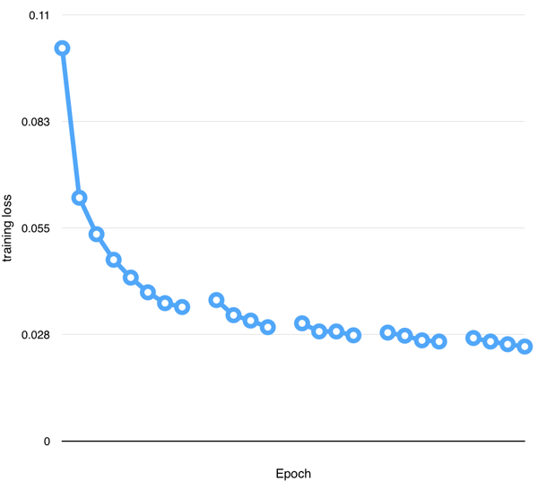
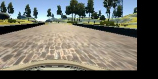
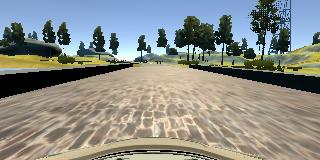

#P3 Behavior Cloning
The objective of this project is to clone the human's driving behavior using the car simulator and the convolutional neural network (CNN). To collect data to train the CNN, we use the simulator to record frame-by-frame images of the track and the corresponding steering angles input by the driver. A properly trained CNN is expected to use each frame as an input and predicts the steering angle as an output. As a result, the car in the simulator can continuously drive itself on the road without going off-track in the autonomous mode.

##File submitted
My project includes the following files:

* **model.py** containing the script to create and train the model
* **drive.py** for driving the car in autonomous mode with the same cropping and resizing methods used in training
* **model.h5** containing a trained convolution neural network 
* **writeup_report.md** summarizing the results
* **writeup_report.pdf** same as above, in case the local images do not load properly in writeup_report.md.
* **image folder** containing images stored locally for displaying in the writeup_report.md.

##Model Architecture
The color images from the dataset has the dimension of 320x160 (WxH). After preprocessing, the image is resized to 220x60 (WxH). The dimension 220x60 is chosen based on Nvidia's paper [End to End Learning for Self-Driving Cars](https://www.google.com/url?sa=t&rct=j&q=&esrc=s&source=web&cd=1&ved=0ahUKEwjJ6sjqw__RAhXL64MKHa5NBd4QFggcMAA&url=https%3A%2F%2Fimages.nvidia.com%2Fcontent%2Ftegra%2Fautomotive%2Fimages%2F2016%2Fsolutions%2Fpdf%2Fend-to-end-dl-using-px.pdf&usg=AFQjCNGgCrFq0dg2NHSt-N0gi9ult70wig&sig2=C-E6D6aB57ozFW6uH0eYUw).  The architecture is similar to the one used in Nvidia's paper. Instead of 5 convolutional layers, I use 3 for simplicity and thought it could speed up the training due to reduced amount of calculation. Since there are no other cars on the simulator's track, there is less complexity in the data compared to that of the Nvidia's paper. 
The first layer, implemented with a Lambda function, performs normalization so that each color channel has the value between -0.5 and 0.5. (model.py lines 196) It is followed by 3 convolutional layers with 3x3 kernel, with the depths between 32 and 128 (model.py lines 197-203). The output from the last convolutional layer is flattened, and fed to 3 fully connected layers (512 -> 64  -> 16). After each convolutional layer, a dropout layer is used to reduced overfitting and a ReLU is used as the activation function to introduce nonlinearity. (model.py lines 198-204) In between the fully connected layers, ELU is used. (model.py lines 209-213) [ELU](http://arxiv.org/pdf/1511.07289v1.pdf) has been shown to enable the network learn faster. The final output is the steering angle to control the car in the simulator. Since the steering angles vary continuously according to the track's curvature, the problem is a regression one. The Adam optimizer is used in the model, while a learning rate of 0.0001 is explicitly specified. Here is a visualization of the architecture.



## Training Strategy
### Data selection
#### Udacity data
The selection of data is critical to the success of the training. Although training mode is available in the simulator to collect data, Udacity provides its data for the students as the starting point. Its data was recorded by 3 cameras: left, center and right. At first glance, it is not clear whether such data is sufficient to train the model. However, after converting the center image sequence to video and play it back, it appears the data consists of balanced amount of data of the car driving in the normal direction of the track and the opposite one.
Here is the Udacity data converted as video:
[Udacity data](https://www.dropbox.com/s/1xrbd48eu9vz1yl/UdacityDataCenterImagesOnly.mov?dl=0).
####User data
I recorded my own data by driving in the normal direction for 4 laps with a [PS3 controller](https://www.walmart.com/ip/Bluetooth-Wireless-Black-Game-Controller-for-PlayStation-3-PS3-USB-Wired-Available/50175929). I used the "Default Mac desktop Universal" simulator to record 3 camera data streams. In the initial comparison, under the same training condition, the model that trains with the User data does not perform as well as the one that trains with Udacity data. Therefore, I decided to use Udacity data to continue the training.

###How the dataset was generated
####Python generator
My first step is to learn how Python generator works since it was mentioned in the project specification. This proves to be a crucial method because of the amount of data required for training. The entire dataset is effectively divided into several batches, with only one batch residing in the memory at a time. For example, if there are 12800 images in the dataset, it will take 100 batches with a batch size of 128 (12800 = 128 * 100) to complete 1 epoch. With a batch size of 128, the Python generator yields 128 images to the CNN for training at a time. The smaller the batch size, the smaller the memory size the system requires.
####Early attempts
The early attempts were not successful. I had no preprocessing other than greyscaling. I only utilized images from the center camera. The car went off the track without passing the first turn.
####Dropping the frames associated with small or zero steering angle units
Since we want to training the car to steer for curvatures, we use a strategy that drops most of the frames with steering angle unit < 0.1 during early epochs. Upon completion of each epoch, we decrease the probability to drop the frames associated with small steering angles, gradually restoring some balance to the training data's bias towards smaller steering angles.
####Number of data per epoch
There are total 8036 sets of center/left/right camera images in the Udacity data. In other words, there are total 24108 (= 8036*3) distinct images in the dataset. I decided on a 90/10 split for training/validation to reduce overfitting. 90% of the total available images yields 21698 which is the number of data per epoch for training.
####Experimenting with the number of epochs
One of the keys in getting a model to drive well on both track 1 and 2 is the number of epochs.  Attempting to train a model that can drive well on both track 1 and track 2, in both normal and opposite directions, I experimented with 8 to 20 epochs using the same model. Initially I used 8 epochs and obtained a training loss of 0.0346. This model did not perform well on track 1. Loading the saved model's weights, I continued the training for 4 more epochs and obtained a training loss of 0.0294. The result is still not satisfactory. Another 4 more epochs later, I obtained a training loss of 0.0273. At this point, the model is capable of driving autonomously loops after loops, but the wheel overlaps the red lines at the 2nd turn after the bridge. Further training with 4 more epochs, I obtained a training loss of 0.0257 and the model can finally drive well on track 1 without the wheels touching either yellow or red lines. Encouraged by the result, I checked the model's performance on track 2 and found it was able to generalize the learning and drive autonomously to reach the end point of track 2 without intervention, even though it has never trained with the data recorded on track 2. I let the model continue to train for 4 more epochs to see if there are any significant performance improvement.  I found the model exhibits slightly less wobbliness on the track. The trained model obtained at epoch 20 became the one for my project submission.
Here is the chart depicting Training loss V.S. Epoch:



####Preprocessing and augmentation
Learning from the Nvidia's paper and discussion with other students in the Slack Carn-ND p-behavioral-cloning channel, I apply preprocessing and augmentation to the data. These steps involve:
* **Brightness**: randomly changing the brightness of the image in the range from 25% to 100%. (model.py line 44) This is meant to train the model so that it is invariant to scene's brightness. Here is an example.   
    Before
       
   After: brightness ratio = 0.635
    
      * **Cropping**: cropping out the sky and the car hood in the image. This greatly reduces the complexity of the data and speeds up training. (model.py line 52) Here is an example.       Before
       
      After: image dimension = 320 x 75 (WxH)
    
   
   
* **Augmenting data from left and right cameras**: Images from the left and right cameras can simulate the view when the car is not driving in the center of the track. By adding or subtracting an offset from the steering angle data of the center camera, we can generate a pair of input and output data using images from either the left or right camera. The offset is chosen empirically in the range of 0.15 - 0.26. For the purpose of simulating the recovery, we subtract the offset from the steering angle, when using the left camera's image. Similarly, we add the offset to the steering angle, when using the right camera's image. The selection of which camera's image to be augmented is random. (model.py lines 80-89)
* **Pixel shifting**: by shifting the pixel to the left or right, we can simulate the change in the camera's view point. (model.py line 16) This augmented data is useful in further training the model for recovery. For every pixel shifting to the left, we subtract 0.004 steering angle unit from the given angle data. Similarly, for every pixel shifting to the right, we add 0.004 steering angle unit to the given angle data. Here is an example.       Before
       
      After (pixel shift x = -42.14; pixel shift y = -17.46; angle shift = -0.16)
          
* **Flipping**: by flipping the image along the vertical-axis, we can simulate the mirror image of the data. (model.py line 61) This technique doubles the amount of usable data. Here is an example.
    Before
       
      After
       
   
* **Compressing the image along the y-axis**: this technique did not make the cut in the final model as it did not seem to improve the model's performance. This augmentation tries to simulate the effect of the road vanishing sooner due to a change in the slope of the track. Here is an example.
    
    Before
       
      After
       
   
* **Creating random trapezoid-shaped shadows**: this technique did not make the cut in the final model as it did not seem to improve the model's performance, especially when running the simulator at higher quality settings such as "good", "beautiful" or "fantastic". At these settings, shadows of the environmental elements are casted onto the track and create an uneven looking surface with high contrast. Here is an example of the augmentation.
   
    Before
   
      After
      

##Testing of the model in autonomous mode
The final model was tested with the graphic quality setting at fastest and screen resolution at 640x480. Tested on track 1, the car was driving autonomously loops after loops without falling off the track and stayed in the center of the track most of the time. The car also performs remarkably well on track 2, handling the many sharp turns without crashing.
##Video

[Autonomous mode track 1](https://www.dropbox.com/s/l6qwtn64ebqubpp/track1_autonomous_mode-SD%20480p.mov?dl=0)

[Autonomous mode track 2](https://www.dropbox.com/s/iwzzowcoihd6so6/track2_autonomous_mode-SD%20480p.mov?dl=0)